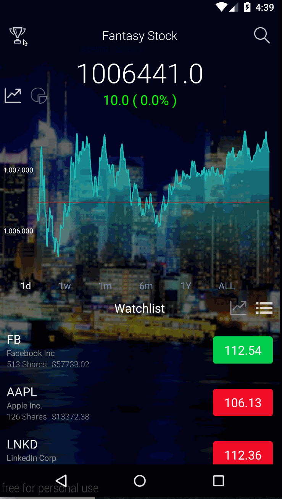
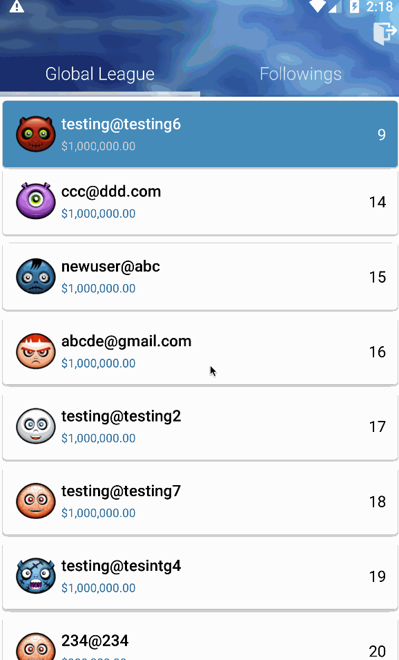

# Fantasy Stock

**Fantasy Stock** is a financial game in which players manage fantasy stocks in real market to compete against each other. Players would receive a virtual funds (1,000,000 dollars) in the beginning of the game and use it to invest companies. At any time, user can see their current earnings and world ranking. We also provides a interface that users can discuss a certain company with each other.

## User Stories

*Required User Stories:*
* [x] SignIn/SignUp with Facebook - 3h
will be able to sign in/sign out/sign up with parse or facebook
* [x] Stock Detail information
Providing Intraday/week/months/years price Chart
how many shares user owns
comments/reply on Specific Stock
profiles of the stocks
News about the stock
* [x] News
In general market news with related Stock, tapping on Stock, it will jump into stock detail
* [x] Watchlist
Stocks that user is following
User is able to edit/delete/rearrange stocks
search for stock/quotes and be able to favorite it
* [x] Transaction Page
User is able to buy/sell
Tutorial telling what’s limited price/market price
* [x] History Page
List of All the transactions history 
Portfolios charts and mark with all the transaction 

*Optional User Stories:*
* [ ] Be able to message/chat with other user
* [ ] favorite/follow other user and show who is following friends
* [ ] create a League and invite other users to join
* [x] multicharts for watchlists
* [x] Ranking

*Notes:*

## Status with app walkthrough

Wireframes: 

https://wireframe.cc/Fs3kPw

*Walkthrough of all user stories:*

Video Walkthrough

Log In

Leader Board

Main Chart

Stock List

Trade

News

Comments

League

GIF created with [LiceCap](http://www.cockos.com/licecap/).

## Open-source libraries used

- [Android Async HTTP](https://github.com/loopj/android-async-http) - Simple asynchronous HTTP requests with JSON parsing
- [Glide](https://github.com/bumptech/glide/) - Image loading and caching library recommended for Android

## License

    Copyright [2016] WeiSheng Su ChengFu Lin Qi Zhu

    Licensed under the Apache License, Version 2.0 (the "License");
    you may not use this file except in compliance with the License.
    You may obtain a copy of the License at

        http://www.apache.org/licenses/LICENSE-2.0

    Unless required by applicable law or agreed to in writing, software
    distributed under the License is distributed on an "AS IS" BASIS,
    WITHOUT WARRANTIES OR CONDITIONS OF ANY KIND, either express or implied.
    See the License for the specific language governing permissions and
    limitations under the License.

